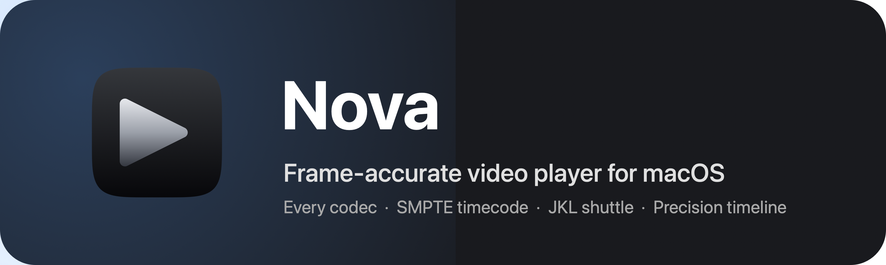
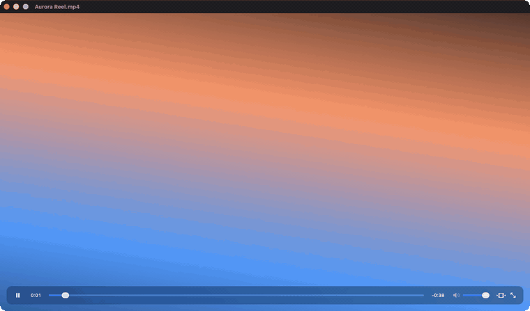
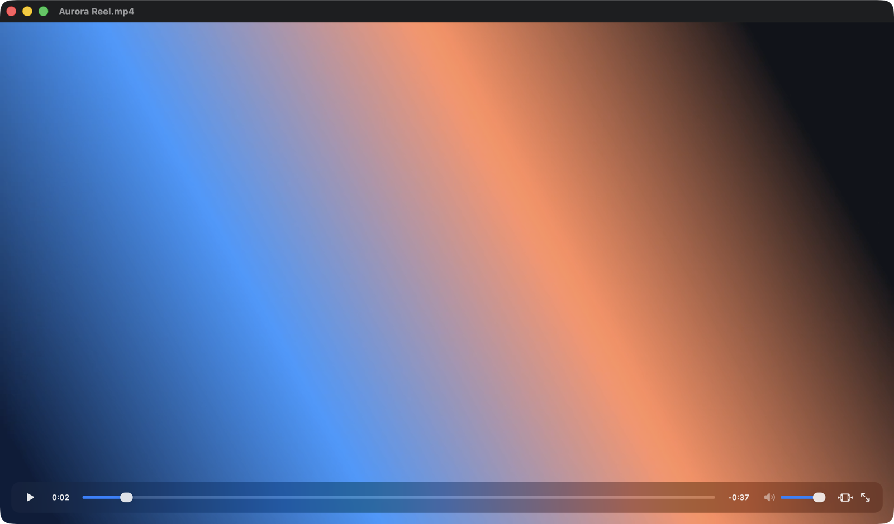
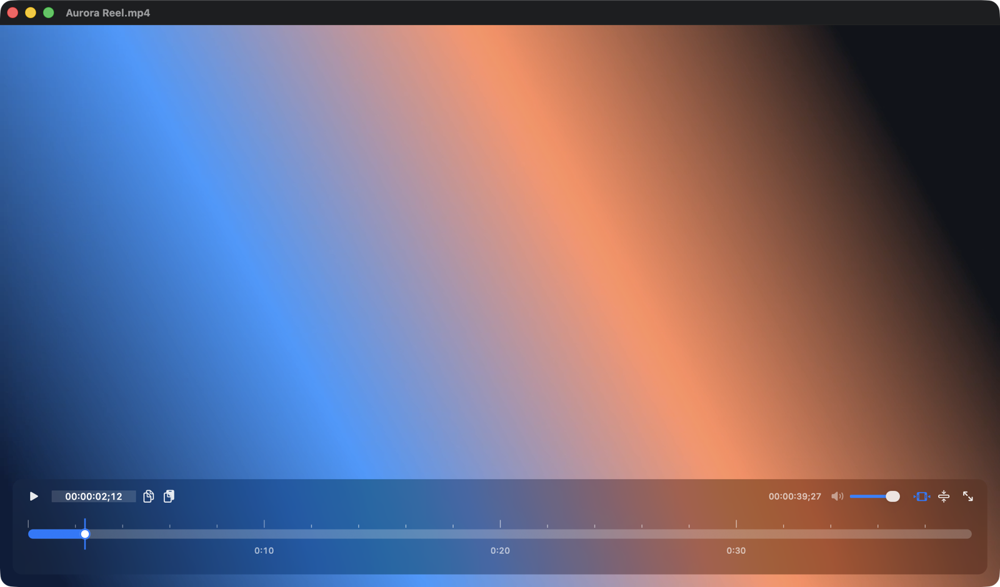
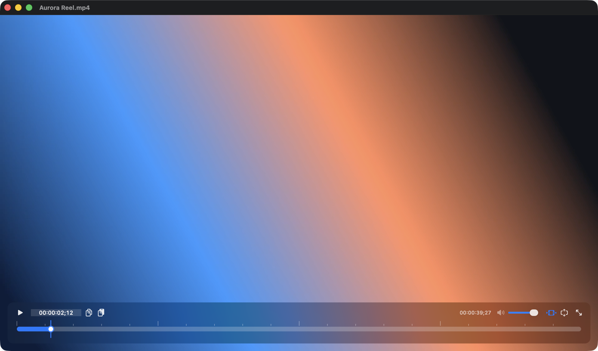

<p align="center">
  <a href="https://github.com/nadim-sheikh/Nova/releases/latest">
    
  </a>
</p>

<p align="center">
  <strong>The frame-accurate video player for macOS.</strong><br>
  Plays every codec, steps by the frame, and speaks SMPTE timecode.<br>
  <sub>Made by Nadim Sheikh · <a href="https://x.com/Nadim_404">@Nadim_404</a></sub>
</p>

<p align="center">
  <a href="https://github.com/nadim-sheikh/Nova/releases/download/v1.0/Nova-1.0.dmg"></a>
  <a href="https://github.com/nadim-sheikh/Nova/releases/latest"></a>
  <a href="LICENSE"></a>
  
  
  <a href="https://x.com/Nadim_404"></a>
</p>

<p align="center">
  
</p>

## Nova

Nova is a native macOS player for people who review footage rather than watch it: editors, VFX and colour artists, QC, anyone who needs to land on frame 1,437 and know that the picture on screen is frame 1,437. It opens anything a codec can throw at it, steps a single frame at a time at any frame rate, shows SMPTE timecode you can copy and paste, and keeps the whole thing in one lightweight AppKit window.

## What you get

- **Plays everything.** Native AVFoundation playback with hardware decoding whenever macOS can handle the file, and a bundled libmpv with a full-decoder FFmpeg build for everything else: ProRes, DNxHD and DNxHR, DV, CineForm, MXF, MKV, WebM, AVI, WMV, FLV, VP9, AV1, Theora and more. There is nothing to install and no fallback to a different app.
- **Frame accurate.** Stepping, seeking and the timeline all land on frame boundaries, at 23.976, 24, 25, 29.97, 30, 50, 59.94, 60 or any other rate the file declares.
- **Timecode you can use.** A live SMPTE readout with drop-frame support, an editable field that only accepts digits, and copy and paste of the current timecode to and from any other app.
- **A timeline that fills the window.** Press <kbd>T</kbd> and the panel morphs into a full-width track with frame ticks, a hover readout and a playhead you can drag with real precision. Pick a full or compact track, and whether files open on the timecode or the transport view, in Settings.
- **JKL shuttle.** Reverse and forward shuttle at editing speeds, including engine-driven reverse playback for files macOS cannot play backwards on its own.
- **Exact frame exports.** Copy the current frame to the clipboard or save it as an image straight from the decoder, not from a screenshot.
- **Stays out of the way.** Float on top, full screen, drag and drop, Open With from Finder, and a window that opens in about half a second. No Electron, no accounts, no telemetry.

## Getting started

<p>
  <a href="https://github.com/nadim-sheikh/Nova/releases/download/v1.0/Nova-1.0.dmg"></a>
</p>

1. Download [Nova-1.0.dmg](https://github.com/nadim-sheikh/Nova/releases/download/v1.0/Nova-1.0.dmg), open it and drag Nova to Applications. Every build is on the [Releases page](https://github.com/nadim-sheikh/Nova/releases).
2. Nova is signed ad hoc rather than with an Apple Developer ID, so Gatekeeper blocks the very first launch. Right-click the app and choose Open, or click "Open Anyway" in System Settings > Privacy & Security, or clear the flag once from Terminal:

   ```bash
   xattr -dr com.apple.quarantine /Applications/Nova.app
   ```

3. Drop a file on the window, press <kbd>⌘O</kbd>, or use Open With in Finder. To make Nova the default player for a format, select a file, press <kbd>⌘I</kbd> and choose Nova under "Open with".

Nova needs macOS 13 Ventura or later and runs natively on Apple silicon and Intel Macs.

<p align="center">
  
</p>

## Keyboard shortcuts

Every shortcut can be remapped in Settings > Keyboard.

| Action | Keys |
| --- | --- |
| Play or pause | <kbd>Space</kbd> |
| Seek backward or forward | <kbd>←</kbd> <kbd>→</kbd> |
| Step one frame backward or forward | <kbd>⇧←</kbd> <kbd>⇧→</kbd> |
| Shuttle reverse, pause, forward | <kbd>J</kbd> <kbd>K</kbd> <kbd>L</kbd> |
| Volume down or up | <kbd>↓</kbd> <kbd>↑</kbd> |
| Expand or collapse the timeline | <kbd>T</kbd> |
| Copy timecode, paste timecode | <kbd>⌥⌘C</kbd> <kbd>⌥⌘V</kbd> |
| Copy frame, save frame | <kbd>⇧⌘C</kbd> <kbd>⇧⌘S</kbd> |
| Float on top | <kbd>⌘T</kbd> |
| Full screen | <kbd>⌃⌘F</kbd> |
| Open a file | <kbd>⌘O</kbd> |

## The timeline

The transport bar and the timeline are one panel. Press <kbd>T</kbd>, click the timeline button, or pick "Expand Timeline" from the View or right-click menu and the bar grows into a track that spans the window. Hover for the timecode under the pointer, drag the playhead to scrub, and edit the timecode field to jump straight to a frame. The two track sizes are a Settings choice, and both keep the copy and paste buttons next to the readout.

<table>
  <tr>
    <td align="center"><br><sub>Full timeline</sub></td>
    <td align="center"><br><sub>Compact timeline</sub></td>
  </tr>
</table>

## Formats and engines

Nova tries AVFoundation first, so anything QuickTime can play gets hardware decoding and the native pipeline. When macOS declines a file, Nova hands it to [libmpv](https://mpv.io) from the [MPVKit](https://github.com/mpvkit/MPVKit) Swift package, rendered through OpenGL into the same window with the same controls. Because MPVKit ships FFmpeg with a decoder whitelist, Nova links its own full-decoder build of FFmpeg 8.1 from `ThirdParty/ffmpeg` ahead of it; `Scripts/build-ffmpeg.sh` reproduces that build from source.

The UI only ever talks to the `PlaybackEngine` protocol in `Nova/Engine`, so either engine can be replaced without touching a view.

## Building from source

```bash
git clone https://github.com/nadim-sheikh/Nova.git
open Nova/Nova.xcodeproj
```

Build and run in Xcode 26. The MPVKit package resolves on the first build and the FFmpeg archives are checked in, so no other setup is needed. `Scripts/make-dmg.sh` builds a universal Release archive and packages it into a disk image in `build/`.

## Testing

`Scripts/harness/make-test-clips.sh <dir>` renders frame-numbered clips in every container Nova supports, and `Scripts/harness/build-and-run.sh <clips…>` opens a real window and checks stepping, seeking, reverse shuttle, frame captures, on-screen frames, timecode copy and paste, the timeline and the menus by reading the frame number back out of the pixels. Run it on an idle machine. The same harness records the README screenshots and GIF through the `NOVA_SHOTS` and `NOVA_GIF` environment variables.

## Repository layout

```
Nova/              App sources
  Core/            Timecode, settings, key bindings, player actions
  Engine/          PlaybackEngine protocol, AVFoundation and libmpv engines
  UI/              Window, control panel, timeline, settings
Nova.xcodeproj/    Hand-maintained Xcode project
Scripts/           FFmpeg build, DMG packaging, icon rendering, test harness
ThirdParty/        Prebuilt full-decoder FFmpeg static libraries
TestMedia/         Small sample clips
assets/            README images and the original icon sources
```

## Developer

Nova is designed and built by **Nadim Sheikh**. Follow [@Nadim_404 on X](https://x.com/Nadim_404) for updates, new releases and what is coming next, and open an [issue](https://github.com/nadim-sheikh/Nova/issues) if something breaks or you want a feature.

<p>
  <a href="https://x.com/Nadim_404"></a>
  <a href="https://github.com/nadim-sheikh"></a>
</p>

## Licence

Nova is open source under the [MIT License](LICENSE).

It links third-party libraries under their own licences: [mpv](https://mpv.io) via the LGPL build of [MPVKit](https://github.com/mpvkit/MPVKit) (LGPL 2.1 or later), [FFmpeg](https://ffmpeg.org) 8.1.2 built as LGPL 3 with no GPL components (`Scripts/build-ffmpeg.sh`), and [dav1d](https://code.videolan.org/videolan/dav1d) (BSD 2-Clause). Because those libraries are linked statically, the LGPL's relinking requirement is met by this repository: the full build is reproducible from source.
